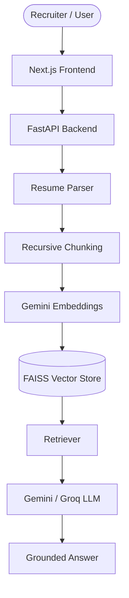
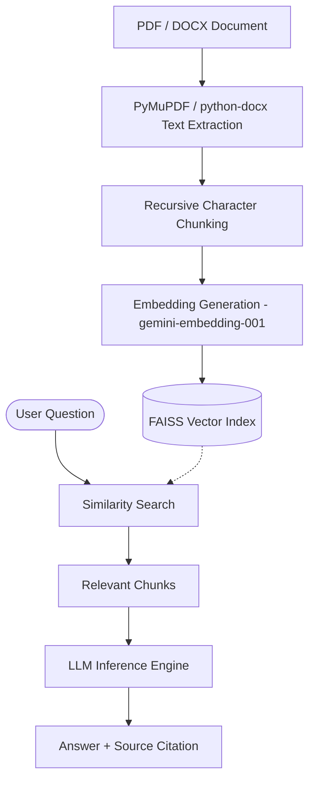
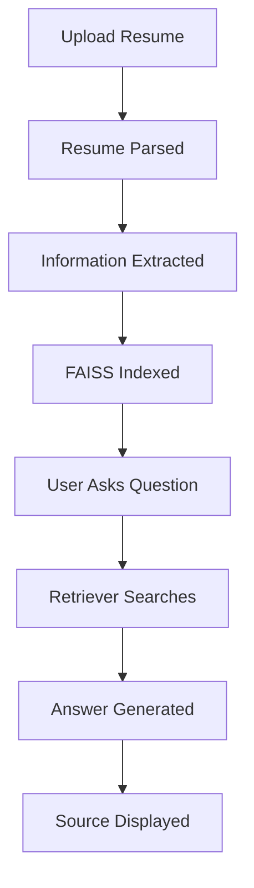
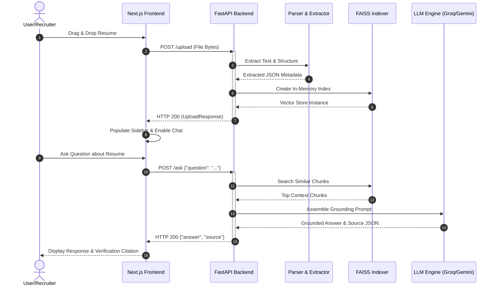
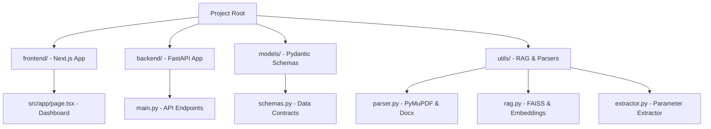
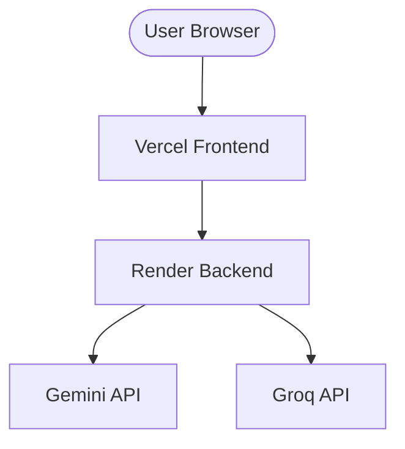
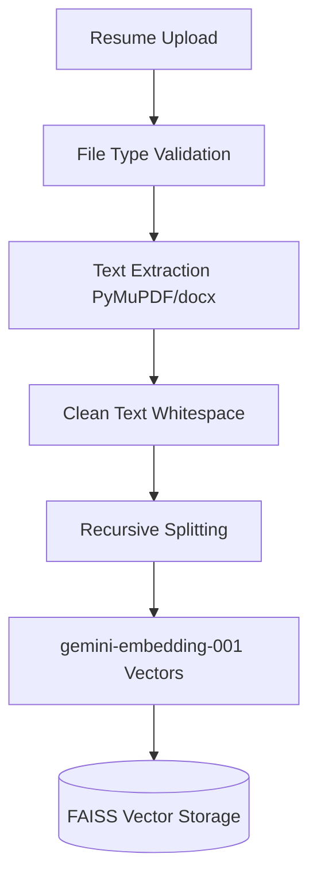
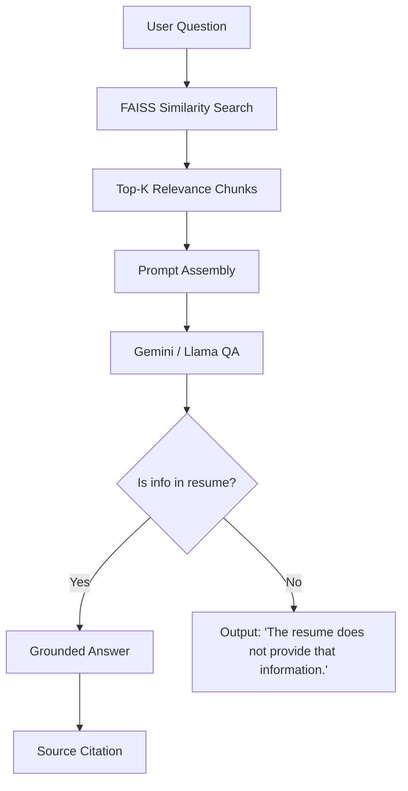

# HireLens AI - Intelligent Candidate Profiling & Grounded Q&A Platform

HireLens AI is an enterprise-grade candidate profile intelligence system designed for recruiters, hiring managers, and talent acquisition teams. The platform automates resume ingestion, extracts core structured parameters (Skills, Work Experience, Projects, Education, and Certifications) into a beautiful workspace, and features a grounded, citation-backed natural language Q&A chatbot that eliminates AI hallucinations by enforcing strict data verification.

---

## ⚡ Key Engineering Highlights

* **Retrieval-Augmented Generation (RAG)**: Standard recursive context routing pipeline built with LangChain and FAISS.
* **FAISS Semantic Search**: Sub-millisecond vector similarity search indexing and retrieval for quick document queries.
* **Gemini Embeddings**: Generative embeddings utilizing `models/gemini-embedding-001`.
* **Grounded Question Answering**: Limits chatbot answers specifically to retrieved context blocks.
* **Source Citations**: Returns exact sentence/paragraph verification containers directly to the recruiter interface.
* **Hallucination Prevention**: Enforces rigid prompt checking, answering *"The resume does not provide that information."* if context is absent.
* **PDF & DOCX Processing**: Parsers built with PyMuPDF (`fitz`) and python-docx, including paragraph, formatting, and table layout extraction.
* **FastAPI + Next.js Architecture**: Clean separation between web API routes and dynamic dark-mode user dashboards.

---

## 🛠️ Technology Stack

* **Frontend**: Next.js 15, TypeScript, Tailwind CSS, Lucide Icons
* **Backend**: FastAPI (Python 3.10+), Uvicorn
* **AI/RAG Orchestration**: LangChain
* **Vector Search**: FAISS (Facebook AI Similarity Search)
* **Embeddings Model**: Google Generative AI Embeddings (`gemini-embedding-001`)
* **Inference Engines**: Groq Cloud API (Llama 3.3 70B & Llama 3.1 8B), Google Gemini 2.5 Flash
* **Document Parsing**: PyMuPDF (`fitz`), python-docx

---

## Deployments
* **Frontend**: Vercel (https://resume-rag-dharmit-shahs-projects.vercel.app/)
* **Backend**: Render (https://resume-rag-d8w2.onrender.com)

---

## 📐 System Diagrams & Architecture

### 1. System Architecture
Showcases the comprehensive layout, detailing how request structures flow from the recruiter interface to backend components and model APIs.



---

### 2. RAG Pipeline
Visualizes the data ingestion path (left) and retrieval-augmented response loop (right) for semantic context lookup.



---

### 3. User Workflow
Illustrates the user journey from resume upload to extraction populate, chat unlock, and query citation.



---

### 4. API Flow
A sequence diagram outlining frontend-backend API interaction for the `/upload` and `/ask` endpoints.



---

### 5. Repository Structure
Illustrates the clean separation of concerns and structural responsibilities.



---

### 6. Deployment Architecture
Details how components are hosted and interact securely with underlying services.



---

### 7. Resume Processing Pipeline
Visualizes raw data verification, validation, text cleaning, chunking, and index compilation.



---

### 8. Question Answering Pipeline
Details similarity lookup, prompt orchestration, non-hallucination validation check, and source citation.



---

## 📁 Repository Directory Structure

* **`frontend/`**: The presentation and user dashboard layer. Created as a single-page reactive workspace utilizing Next.js, React, Tailwind CSS, and Lucide icons.
* **`backend/`**: Web framework layer built on FastAPI. Hosts routers, app-state configurations, CORS middleware, and error-handling controllers.
* **`models/`**: Pydantic schema schemas providing strict data type validation and contract safety across frontend/backend communication.
* **`utils/`**: Core intelligence layer containing:
  * `parser.py`: PDF (PyMuPDF) and DOCX (python-docx) extraction.
  * `rag.py`: Recursive splitting, embedding vector creation, and local in-memory FAISS indexing.
  * `extractor.py`: Structured metadata parameter extraction with fallback mechanism.

---

## ✨ Features & Platform Capabilities

* **PDF Ingestion**: Fast extraction of text, formatting, and tables from PDF structures.
* **DOCX Ingestion**: Automatic parsing of document paragraphs and tabular contents.
* **Resume Parsing & Parameters Extraction**: Structured parsing of years of experience, technical competency matrix, project history, education, and credentials.
* **Dynamic Sidebar Updates**: Candidate parameters update automatically into Ashby/Lever-style card components upon ingestion.
* **FAISS Contextual Retrieval**: Semantic, vector-based similarity retrieval using LangChain and Google Generative AI embeddings.
* **Grounded Verification**: Strictly prevents hallucinations. Answers are generated *only* from resume context.
* **Source Citations**: Chatbot returns the exact text block, sentence, or paragraph from the resume that verifies its claims.
* **Fast Fallback Engine**: Uses Groq (`llama-3.3-70b-versatile` & `llama-3.1-8b-instant`) for sub-second speeds, falling back to Gemini 2.5 Flash if rate limits are exceeded.

---

## 🔒 Hallucination Prevention

The system enforces strict grounding rules inside its system prompts. If a recruiter asks a question about details that are missing from the candidate's resume (e.g. *"Does the candidate know Rust?"* or *"Who won the 2022 World Cup?"*), the system outputs:

> `"The resume does not provide that information."`

This ensures that candidate screening metrics are 100% accurate, trustworthy, and verifiable.

---

## 📥 Installation & Local Setup

### Prerequisites
* Python 3.10+
* Node.js 18+ & npm
* Google AI Studio (Gemini) API Key and/or Groq Console API Key

### 1. Environment Variables Configuration
Copy the configuration template from the root directory:
```bash
cp .env.example .env
```
Open the `.env` file and populate your keys:
```env
GEMINI_API_KEY=......
GROQ_API_KEY=......
```

### 2. Backend Server Launch
Install backend requirements and start the FastAPI Uvicorn server:
```bash
# Navigate to root (if not already there)
# Install dependencies
pip install -r requirements.txt

# Start the local server
python -m uvicorn backend.main:app --host 127.0.0.1 --port 8000
```
*The interactive API documentation will be available at [http://127.0.0.1:8000/docs](http://127.0.0.1:8000/docs).*

### 3. Frontend Dashboard Launch
Install node modules and launch the Next.js development server:
```bash
# Navigate to the frontend directory
cd frontend

# Install package dependencies
npm install

# Run the dev server
npm run dev
```
*Open [http://localhost:3000](http://localhost:3000) to view the recruiter workspace dashboard.*

---

## 🔌 API Documentation

### 1. Ingest Resume
* **Endpoint**: `POST /upload`
* **Content-Type**: `multipart/form-data`
* **Payload**: Form key `file` containing document bytes (`.pdf` or `.docx`).
* **Response (200 OK)**:
```json
{
  "status": "success",
  "pages": 2,
  "characters": 3540,
  "extracted_data": {
    "skills": ["Python", "FastAPI", "React", "TypeScript", "SQL"],
    "experience_years": "5.5 years",
    "projects": ["Built a RAG pipeline", "Developed SaaS dashboard"],
    "education": ["BS Computer Science - State University"],
    "certifications": ["AWS Certified Solutions Architect"]
  }
}
```

### 2. Query Resume
* **Endpoint**: `POST /ask`
* **Content-Type**: `application/json`
* **Request Payload**:
```json
{
  "question": "What experience does the candidate have with AWS?"
}
```
* **Response (200 OK)**:
```json
{
  "answer": "The candidate has worked with AWS for 2 years, specifically setting up RDS databases and deploying EC2 instances.",
  "source": "Software Engineer Intern (2022) - Deployed microservices on AWS EC2 and managed RDS PostgreSQL instances."
}
```

---

## 🙋 Demo Questions

Recruiters can use these prompts to test grounding and citation accuracy:
* *Summarize this candidate.*
* *What skills does this candidate have?*
* *What projects has this candidate worked on?*
* *What education does this candidate have?*
* *What certifications does this candidate have?*
* *What experience does the candidate have with Kubernetes?* (Tests the `"The resume does not provide that information."` response if missing)

---
### Deploying Frontend to Vercel
1. Link your repository in Vercel.
2. Select `frontend` as the root directory.
3. Configure the environment variable:
   * `NEXT_PUBLIC_API_URL`: Set to the deployed URL of your FastAPI backend.
